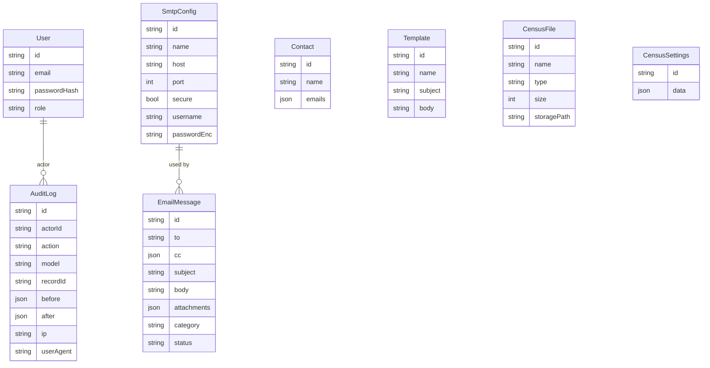

# Backend API (NestJS + Prisma + PostgreSQL)

Este proyecto implementa el backend para el frontend del ZIP provisto (Vite/React), con:

- CRUD de **perfiles SMTP** (`/api/smtp-configs`)
- CRUD de **contactos** (`/api/contacts`)
- CRUD de **plantillas** (`/api/templates`)
- **Censos**: carga de archivos y settings (`/api/census-files`, `/api/census-settings`)
- **Envío de email** con múltiples destinatarios + CC + adjuntos (`/api/mail/send`)
- **Historial** de envíos (`/api/history`)
- **Reportes** exportables a **PDF** y **Excel** (`/api/reports/*`)
- **Audit trail** persistido en DB (`AuditLog`) para cualquier alta/baja/modificación relevante

> El frontend usa `API_BASE_URL = '/api'`. Este backend expone el prefijo `/api` por defecto.

---

## Stack elegido

- **Node.js + TypeScript**
- **NestJS** (arquitectura modular, Swagger, validación)
- **PostgreSQL**
- **Prisma** (ORM + migrations)
- **Nodemailer** (SMTP)
- **pino-http** + Helmet (logs técnicos + hardening)
- **PDFKit** y **ExcelJS** (exportables)

---

## Levantar el entorno (local)

### 1) Requisitos
- Node 18+
- Docker (para PostgreSQL)

### 2) Base de datos
```bash
docker compose up -d
```

### 3) Variables de entorno
```bash
cp .env.example .env
# Editar .env (JWT_SECRET / ENCRYPTION_KEY como mínimo)
```

### 4) Instalar dependencias y migrar
```bash
npm install
npm run prisma:generate
npm run prisma:migrate
```

### 5) Ejecutar
```bash
npm run dev
```

- API: `http://localhost:3001/api`
- Swagger: `http://localhost:3001/api/docs`

---

## Autenticación (modo)

Para que el frontend funcione **sin cambios**, seteá auth en modo abierto:

```
AUTH_MODE=none
# (recomendado para desarrollo local con este frontend)
```

Si usás JWT:
- `POST /api/auth/login` → `{ accessToken }`
- En Swagger, usar **Authorize** con `Bearer <token>`.

Bootstrap opcional de admin:
- `BOOTSTRAP_ADMIN_EMAIL`
- `BOOTSTRAP_ADMIN_PASSWORD`

---

## Endpoints esperados por el Frontend

> Coinciden con el `apiService.ts` del frontend.

### SMTP Configs
- `GET /api/smtp-configs`
- `POST /api/smtp-configs`
- `PUT /api/smtp-configs/:id`
- `DELETE /api/smtp-configs/:id`

> La password se guarda **encriptada**. Por seguridad, no se devuelve; se expone `hasPassword`.

### Contacts
- `GET /api/contacts`
- `POST /api/contacts`
- `PUT /api/contacts/:id`
- `DELETE /api/contacts/:id`

### Templates
- `GET /api/templates`
- `POST /api/templates`
- `PUT /api/templates/:id`
- `DELETE /api/templates/:id`

### Census
- `GET /api/census-files`
- `POST /api/census-files` (acepta el mismo objeto que el frontend: `id`, `name`, `size`, `type`, `uploadDate`, `content` dataURL)
- `DELETE /api/census-files/:id`
- `GET /api/census-files/:id/download`
- `GET /api/census-settings`
- `PUT /api/census-settings` (recibe directamente el objeto `CensusSettings` del frontend)

### Email
- `POST /api/mail/send`
- `GET /api/history`

### Reportes (exportables)
- `GET /api/reports/email-activity?from=YYYY-MM-DD&to=YYYY-MM-DD`
- `GET /api/reports/email-activity.xlsx?...`
- `GET /api/reports/email-activity.pdf?...`
- `GET /api/reports/audit-summary?from=...&to=...`
- `GET /api/reports/audit-summary.xlsx?...`

### Auditoría
- `GET /api/audit?model=SmtpConfig&recordId=<id>&take=100`

---

## Adjuntos: cómo se soportan

El frontend actual arma adjuntos como metadatos (`name/type/size`). Este backend soporta adjuntos tal como los manda el frontend (`attachments[].data` como DataURL):

```json
{
  "id": "1700000000000",
  "name": "reporte.pdf",
  "type": "application/pdf",
  "size": 12345,
  "data": "data:application/pdf;base64,JVBERi0x..."
}
```

También acepta `contentBase64` (alias) o `storagePath` (avanzado).

---

## Esquema de Base de Datos

### Prisma schema
Ver: `prisma/schema.prisma`

### ERD (Mermaid)


---

## Notas de seguridad

- **Helmet** habilitado.
- Password SMTP: **encriptado at-rest** (AES-256-GCM).
- Validación estricta con `class-validator` y `whitelist`.
- Audit trail persistente en `AuditLog`.

---

## Próximos pasos recomendados (si lo querés “enterprise-ready”)

- Separar storage de archivos a S3/MinIO.
- Rate limiting (por IP y por usuario).
- Roles/permissions granulares.
- Workers/queue (BullMQ) para envíos masivos y reintentos.
- Observabilidad: OpenTelemetry + métricas Prometheus.
